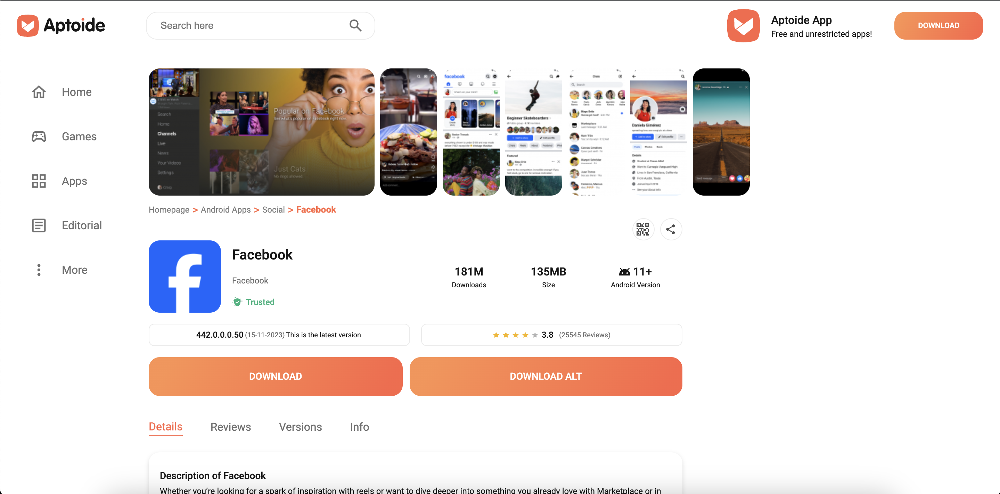

# Aptoide APK Downloader Extension

Download APK directly from Aptoide.com to PC/Laptop.

## Usage

To use this extension, you need to install it from [Chrome Web Store](https://chromewebstore.google.com/detail/aptoide-chrome-extension/jhghkkgmplgbifchnfkighggbbadppgl?hl=en).

There are two ways to download APK from Aptoide.com using this extension.

### Method 1

1. Go to Aptoide.com.
2. Search for the app you want to download.
3. Click on the app.
4. You will see a two download buttons instead of one, which will download the APK directly to your PC/Laptop. See the screenshots below.
5. Also, on versions list, you will see two download buttons as well for each version.
6. Enjoy!

### Method 2

1. Click on the extension icon.
2. Search for the app you want to download.
3. If the app is found, you will see two download buttons for each app in list.
4. Click the download button to download the APK directly to your PC/Laptop.
5. Enjoy!

## Screenshots

